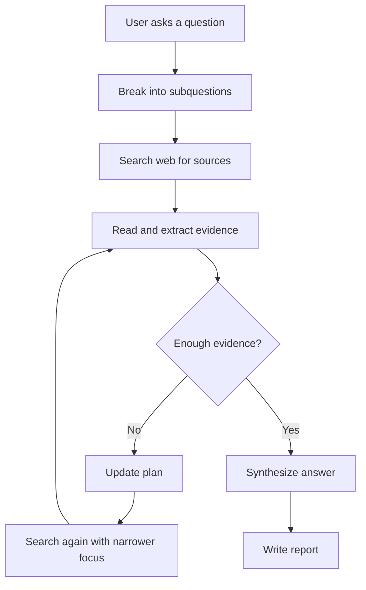
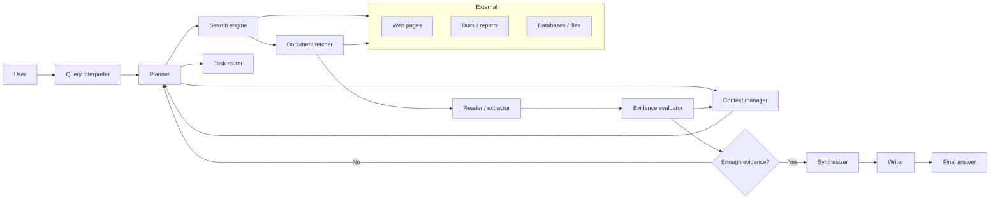
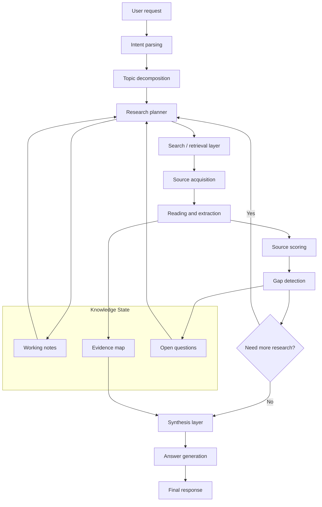
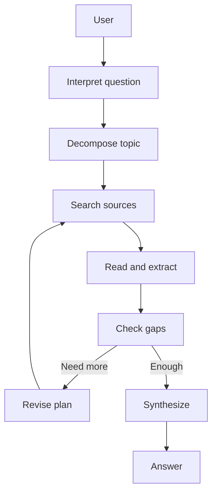

# Deep Research Workflow and Architecture

This document explains how Deep Research likely works technically, how the plan gets updated, what the system architecture looks like, and how similar products approach the same problem.

## How Deep Research works

Deep Research is an agentic workflow that uses search and coding tools to iteratively gather sources, read them, reason about next steps, and synthesize the results into a report. The key difference from ordinary search is that it runs in a loop instead of doing a single pass.

## Core loop



## What “update the plan” means

The system does not follow one fixed query from start to finish. It keeps a working understanding of:
- what the user wants,
- what has already been learned,
- what evidence is still missing,
- and what should be searched next.

When evidence is incomplete or contradictory, it can:
- narrow the scope,
- add missing subquestions,
- change search terms,
- target better source types,
- or shift from broad exploration to verification.

That is the main reason Deep Research behaves like an investigator rather than a static search tool.

## More detailed system architecture



## Component roles

### Query interpreter
Turns the user’s question into a research task and identifies the topic, scope, and constraints.

### Planner
Creates the initial research plan and revises it as new evidence arrives.

### Task router
Decides what action to take next, such as broad search, targeted lookup, document reading, or verification.

### Search engine and document fetcher
Find and retrieve sources so the system can inspect full content rather than only snippets.

### Reader / extractor
Pulls out facts, claims, numbers, dates, and relationships from the sources.

### Evidence evaluator
Checks whether the current information is complete, consistent, and trustworthy enough.

### Context manager
Keeps track of what has already been learned so the system does not repeat work.

### Synthesizer and writer
Organize the findings and produce the final response with citations and readable structure.

## Example of plan revision

If the question is about comparing AI regulation bills across regions, the system may:
1. Split the topic by region.
2. Search each region’s official sources.
3. Extract scope, penalties, and status.
4. Detect gaps or contradictions.
5. Revise the plan and search more precisely.
6. Compare the final evidence.
7. Write the synthesis.

If the system discovers that one region only has draft proposals while another has enacted law, it may adjust the comparison so it is not mixing draft and final-stage materials.

## How similar products do it

Most comparable products follow the same broad pattern:
- a planner breaks the task apart,
- retrieval workers gather evidence,
- reading and scoring components evaluate sources,
- and a synthesizer writes the final result.

Some products use a single looping agent. Others use multiple agents in parallel and then merge the results.

## Common architecture styles

| Style | How it works | Trait |
|---|---|---|
| Orchestrator-worker | One lead agent coordinates several workers in parallel. | Good for broad, complex tasks. |
| Sequential loop | One agent searches, reads, updates the plan, then repeats. | Simpler and easier to control. |
| Hybrid pipeline | Fixed stages with agent decisions at key points. | More predictable in production. |

## System architecture diagram for Deep Research



## How to read the system architecture

### Intent parsing
Identifies what kind of answer is needed: explanation, comparison, timeline, factual lookup, or synthesis.

### Topic decomposition
Breaks a complex question into smaller subquestions.

### Research planner
Creates and revises the plan, deciding what to search next.

### Search / retrieval layer
Finds candidate sources.

### Source acquisition
Loads full documents or pages.

### Reading and extraction
Extracts relevant facts, claims, and evidence.

### Source scoring
Judges source quality, relevance, and reliability.

### Gap detection
Finds missing information or conflicts.

### Synthesis layer
Combines the evidence into a coherent answer.

### Answer generation
Produces the final response with citations and structure.

## A simple workflow version



## Why the workflow matters

The iterative loop is what makes Deep Research different from a normal search engine. Instead of stopping after the first set of results, it keeps adapting until the evidence set is strong enough.

## How to package this as a Markdown doc

If you want to turn this into a file, save it as something like:

```text
deep-research-workflow.md
```

You can then open it in any Markdown editor, notes app, or documentation system.

## Short version

Deep Research works like this:
1. Understand the question.
2. Break it into subquestions.
3. Search and read sources.
4. Evaluate what is missing.
5. Update the plan.
6. Repeat until coverage is sufficient.
7. Write the final answer.

If you want, I can also convert this into a polished README, a slide deck outline, or a plain-text architecture diagram.